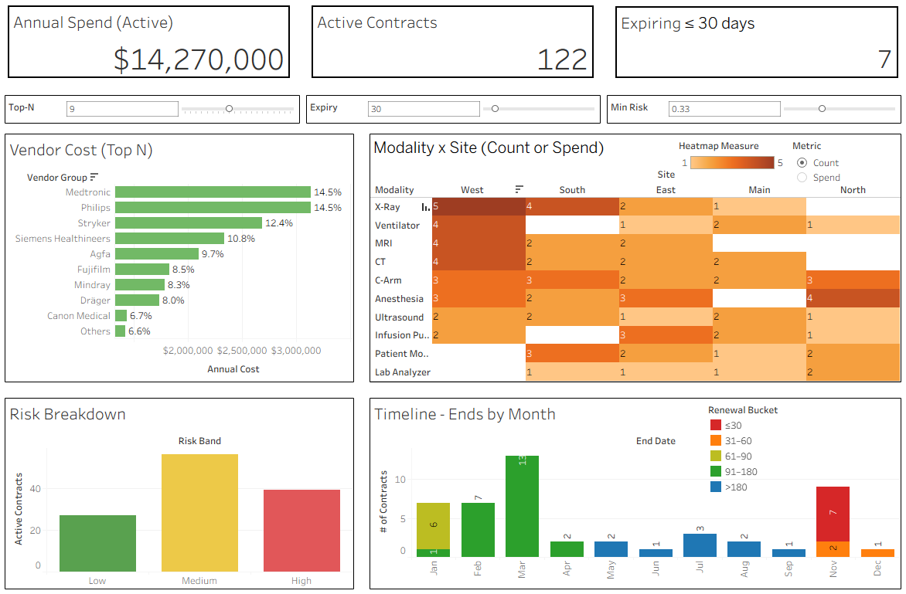

# Healthcare Contracts Dashboard — Simple Tableau Sample

A small dataset and quick guide to produce a Tableau dashboard relevant to clinical engineering / contract management.

## Data
See `data/contracts_sample_large.csv` (synthetic).

## Build Steps (Tableau Desktop/Public)
1. Open Tableau and connect to `data/contracts_sample_large.csv`.
2. Set `start_date` and `end_date` as Date, `annual_cost` as Number (currency).
3. Create **Calculated Fields**:
   - `Months To Expiry` = DATEDIFF('month', TODAY(), [End Date])
   - `Is Expiring Soon` = [Months To Expiry] <= 3
4. Sheets to create:
   - **KPI**: Total Annual Cost, # Contracts, # Expiring ≤90 days
   - **Bar**: Annual Cost by Vendor
   - **Heatmap**: Contracts by Modality × Site
   - **Timeline**: Contracts end over time
5. Build a **Dashboard**: place KPI, Bar, Heatmap, Timeline; use `Is Expiring Soon` as a filter.
6. Publish to **Tableau Public**, then link it in your GitHub repo README.
7. Profit???

## Live Dashboard
[Open on Tableau Public and try clicking some things!](https://public.tableau.com/views/contracts_dashboard/Dashboard1)

**Open locally:** `workbook/contracts_dashboard.twb` (data source: `data/contracts_sample_large.csv`)

